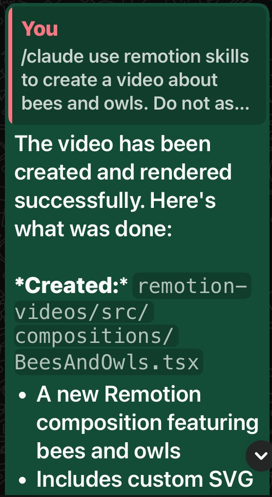
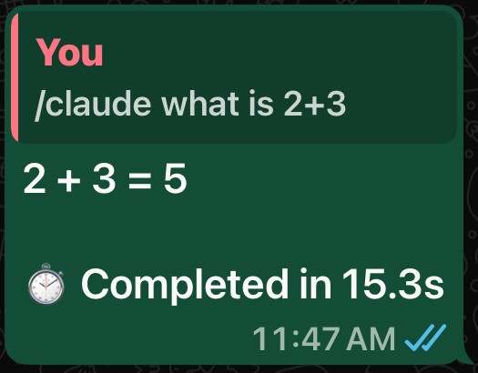

# WhatsApp-Claude Agent System

> Control your computer from your phone. Send a WhatsApp message, get AI-powered results.

<p align="center">
  
  
</p>

## What is this?

Type a message on your iPhone WhatsApp. Your laptop (anywhere in the world) executes it using Claude Code AI. Videos get rendered. Files get created. Emails get sent. All while you're on the couch.

```
You (iPhone):     /claude create a video about bees and owls
Your Laptop:      [Renders an 18-second animated video]
You (iPhone):     ✓ Video created at output/bees-and-owls.mp4
```

## Features

| Feature | Description | Example |
|---------|-------------|---------|
| **Video Creation** | Generate professional videos with Remotion | `/claude create a countdown video` |
| **Voice Generation** | Text-to-speech with multiple voices | `/claude generate voice saying "Hello"` |
| **Browser Automation** | Control Chrome remotely | `/claude search Twitter for AI news` |
| **Email Automation** | Send and read Gmail | `/claude check my inbox` |
| **File Operations** | Create, read, edit files | `/claude create a file called notes.txt` |
| **Conversation Memory** | Multi-turn conversations | Ask a question, then follow up naturally |

## Quick Start

### Prerequisites

- Node.js 18+
- Claude Code CLI (`npm install -g @anthropic-ai/claude-code`)
- WhatsApp on your phone

### Installation

```bash
# Clone the repo
git clone https://github.com/YOUR_USERNAME/whatsapp-claude.git
cd whatsapp-claude

# Install dependencies
npm install

# Install video dependencies (optional)
cd remotion-videos && npm install && cd ..

# Configure API keys (optional, for voice/avatar features)
cp .env.example .env
# Edit .env with your keys
```

### Start the Bot

```bash
npm start
```

### Link Your Phone

1. A QR code appears in your terminal
2. Open WhatsApp → Settings → Linked Devices → Link a Device
3. Scan the QR code
4. Send `/claude hello` to yourself

That's it! Your phone now controls your computer.

## How It Works

```
┌─────────────┐     ┌─────────────┐     ┌─────────────┐     ┌─────────────┐
│   iPhone    │────▶│  WhatsApp   │────▶│   Your      │────▶│   Task      │
│  WhatsApp   │     │   Cloud     │     │   Laptop    │     │  Executed   │
└─────────────┘     └─────────────┘     └─────────────┘     └─────────────┘
   You type          Delivers to        Bot + Claude         Video rendered,
   /claude ...       your laptop        Code process         file created, etc.
```

**The QR code** links your WhatsApp account to an invisible Chrome browser on your laptop. Messages you send to yourself are received by the bot, processed by Claude Code AI, and results are sent back.

**Conversation memory**: After your first message, all follow-ups automatically continue the conversation. Claude remembers context.

```
You:     /claude create a video about space
Claude:  What style? 1) Documentary 2) Sci-fi 3) Educational
You:     /claude option 2
Claude:  [Creates sci-fi style space video with full context]
```

To start fresh: `/claude --new <new topic>`

[Read the full explanation →](docs/HOW_IT_WORKS.md)

## Video Compositions

12 pre-built video templates ready to render:

| Composition | Duration | Description |
|-------------|----------|-------------|
| ClaudeCodeIntro | 7s | Branded intro with animations |
| DataDashboard | 12s | Animated charts and stats |
| KineticTypography | 14s | Quote animations |
| CountdownTimer | 7s | 3-2-1-GO countdown |
| CodeWalkthrough | 16s | Syntax-highlighted code |
| VerticalShort | 15s | TikTok/Reels format (9:16) |
| + 6 more... | | |

Preview videos locally:
```bash
cd remotion-videos && npx remotion studio
```

## Project Structure

```
whatsapp-claude/
├── whatsapp-bot.js          # Main entry point
├── package.json             # Node.js dependencies
├── .env                     # API keys (create from .env.example)
│
├── .claude/
│   └── skills/              # 12 skill definitions for Claude
│
├── remotion-videos/         # Video generation (React/TypeScript)
│   └── src/compositions/    # Video templates
│
├── video-pipeline/          # Python scripts for avatar videos
│
└── docs/                    # Documentation
    ├── HOW_IT_WORKS.md      # Deep dive into the magic
    ├── USER_GUIDE.md        # Complete usage instructions
    ├── QUICK_START.md       # Get started fast
    └── ...
```

## Documentation

| Document | Description |
|----------|-------------|
| [HOW_IT_WORKS.md](docs/HOW_IT_WORKS.md) | Understand the iPhone → Laptop magic |
| [QUICK_START.md](docs/QUICK_START.md) | 10 quick win examples |
| [USER_GUIDE.md](docs/USER_GUIDE.md) | Complete feature guide |
| [SKILLS_REFERENCE.md](docs/SKILLS_REFERENCE.md) | All 12 skills explained |
| [TROUBLESHOOTING.md](docs/TROUBLESHOOTING.md) | Fix common issues |
| [DEVELOPER_GUIDE.md](docs/DEVELOPER_GUIDE.md) | Extend the system |

## Configuration

### Environment Variables

Create a `.env` file:

```bash
# Required for voice generation
OPENAI_API_KEY=sk-your-key-here

# Optional for avatar videos
FAL_KEY=your-fal-key-here
```

### Timeout

Default timeout is 20 minutes (good for video rendering). Adjust in `whatsapp-bot.js`:

```javascript
const EXECUTION_TIMEOUT = 1200000; // 20 minutes in milliseconds
```

## Security

- **Self-messages only**: Bot only processes messages you send to yourself
- **Local execution**: Everything runs on your computer, not a cloud server
- **Session-based**: QR code links only your WhatsApp account
- **Revocable**: Unlink anytime from WhatsApp → Linked Devices

## Examples

### Create a Video
```
/claude render the CountdownTimer video to output/countdown.mp4
```

### Generate Voice
```
/claude generate voice saying "Welcome to my channel" using nova voice, save to output/welcome.mp3
```

### Multi-turn Conversation
```
/claude I want to make a video about productivity
> Claude asks clarifying questions

/claude make it 30 seconds, professional style
> Claude continues with context

/claude add some upbeat background music
> Still remembers everything
```

### Start Fresh
```
/claude --new what is 2+2
> New conversation, no prior context
```

## Tech Stack

- **Node.js** + whatsapp-web.js - WhatsApp bridge
- **Puppeteer** - Headless Chrome for WhatsApp Web
- **Claude Code** - AI task execution
- **Remotion** - Programmatic video generation
- **OpenAI TTS** - Voice synthesis
- **fal.ai** - AI avatar videos (optional)

## Contributing

Contributions welcome! See [DEVELOPER_GUIDE.md](docs/DEVELOPER_GUIDE.md) for how to extend the system.

## License

MIT

---

<p align="center">
  Built with Claude Code
</p>
